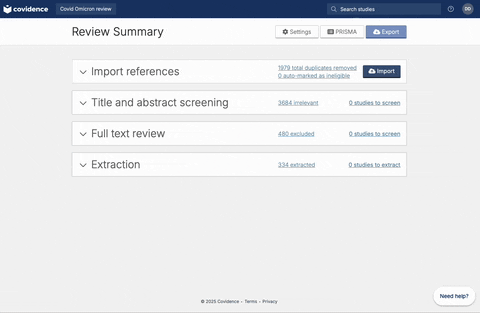
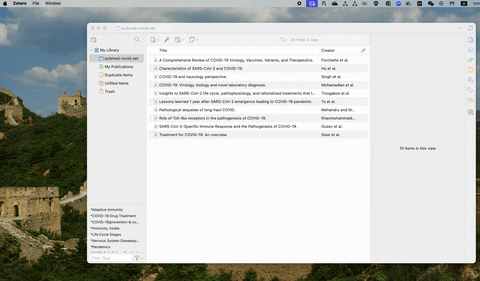
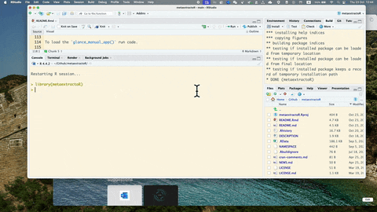
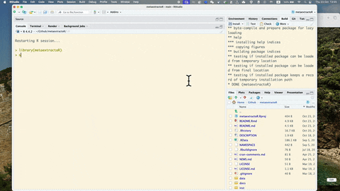

```{r, include = FALSE}
knitr::opts_chunk$set(
  collapse = TRUE,
  comment = "#>",
  fig.path = "man/figures/README-",
  out.width = "100%",
  eval = TRUE
)
```

<!-- badges: start -->
[](https://CRAN.R-project.org/package=metaextractoR)
[](https://CRAN.R-project.org/package=metaextractoR) [](https://lifecycle.r-lib.org/articles/stages.html#experimental)
<!-- badges: end -->


## Installation

To install the package:

```r
remotes::install_github("danyangdai/metaextractoR")
```

Download and install Large Language Models (LLMs) for local usage supported by `metaextractoR`. Run the code below in Terminal or Console to install models:

```r
ollama run your_choice_of_models
```

Explore your choice of models at [Ollama](https://ollama.com). Currently this version of the package only supports local LLMs via Ollama. 


## Workflow 

This package design fit in to the [Preferred Reporting Items for Systematic reviews and Meta-Analyses (PRISMA)](https://www.prisma-statement.org/) guideline for systematic review and meta-analysis. 

For systematic review and meta-analysis, users are encouraged to follow the study protocol developed for the systematic review and meta-analysis. This package will streamline the data extraction part in your systematic review with the power of Large Language Models (LLMs) while keeping a human in the loop for accuracy and oversight. 

For more information, see our working paper [here](https://github.com/DanyangDai/LLM-Meta-Analysis/blob/main/RSM/RSM.pdf).

### 1. Getting the abstract information 

Once full-text review has been completed, you should have a list of articles included for the full-text extraction. At this stage, the user should have a csv file that contains a list of abstracts. If you are using [Covidence](https://www.covidence.org), the csv file can be downloaded following the steps below:  





If you are using free reference management software such as [Zotero](https://www.zotero.org/), the csv file contains abstracts can be exported following the steps below:




You can also use the sample data provided to you using `data("abstracts")` to load in a sample abstracts downloaded from Covidence. 


### 2. Adding new columns to the raw abstract file

Once you have download or exported the csv file containing the abstracts, you can read in the csv file to your R environment. Below we use our example data.

```{r}
library(metaextractoR)
str(abstracts)
```


Following your systematic review protocol, we are going to create empty columns with pre-defined data extraction elements by using the function, `add_predefined_vars`. The new columns create placeholders for values entered either manuallly or extracted from a LLM.


```{r}
abstracts_wt_vars <- add_predefined_vars(
  abstracts,
  c("no_participants", "no_aki", "age_mean", "age_sd")
)
str(abstracts_wt_vars)
```


Before processing to the next step, check the current dataset contains all the data items with `_llm` and `_manual`. Most importantly, this data must contains abstract column. Use `colnames()` function to check the available variables in the dataset. 


### 3. Separating training and testing sets

We are going to separate the full abstracts sample into traning and testing sets. 

The training set will be used in Shinyapp 1 `glance_manual_app()` and Shinyapp 2 `prompt_engineering_app()`.

Using function `separate_training()` to divide the full sample into training and testing. Follow the example:

```{r}
separate_abs <- separate_training(abstracts_wt_vars, percentage = 0.4)
```

To make sure that we are consistent with our training set and to avoid contamination of the testing set, we will save the training and testing abstracts into csv files. 

To save the training set: `save_training_data()`. This function will create a folder named "metaextractor_data" folder under your current working directory. If you could not find your current working directory, use `getwd()` to find your current working directory. Follow the example to save the training and testing csv files:

```{r}
#| eval: false
save_training_data(separate_abs$train)

save_testing_data(separate_abs$test)
```

Notice that you should have two `.csv` file saved to `metaextractor_data` folder under the current working directory, one called: "training_stage_0_data.csv" another called: "testing_stage_0_data.csv". The name of the file has been pre-fixed to ensure the correct file goes into the Shinyapps. 


### 4. `glance_manual_app()`: manual data extraction from abstracts for the training set. 

Under the `metaextractor_data` folder, the `training_stage_0_data.csv` file should be uploaded to the `glance_manual_app()` Shinyapp. 

To load the `glance_manual_app()` run code.

```{r}
#| eval: false
glance_manual_app()
```




To see more detailed usage of this `glance_manual_app()`, see YouTube video: 

### 5. `prompt_engineering_app()`: prompt enginnering and model selection

Once the manual extraction is completed with the `glance_manual_app()`, the testing data should be saved. The saved data should be used in the prompt engineering Shinyapp. 




To see more detailed usage of this `prompt_engineering_app()`, see YouTube video: 

Each of the tested prompt and model is recorded and saved as a csv file in the `log_files` folder. 

### 6. Batch process with `process_with_ollama`

Once the most ideal prompt and model is selected, use the `process_with_ollama` for the testing with LLMs to extract the data elements. 


### 7. Manual check with `manual_validation_app()`

Once LLM extraction on the testing set been completed, use the `manual_validation_app()` to manually check the LLM extraction values. 


